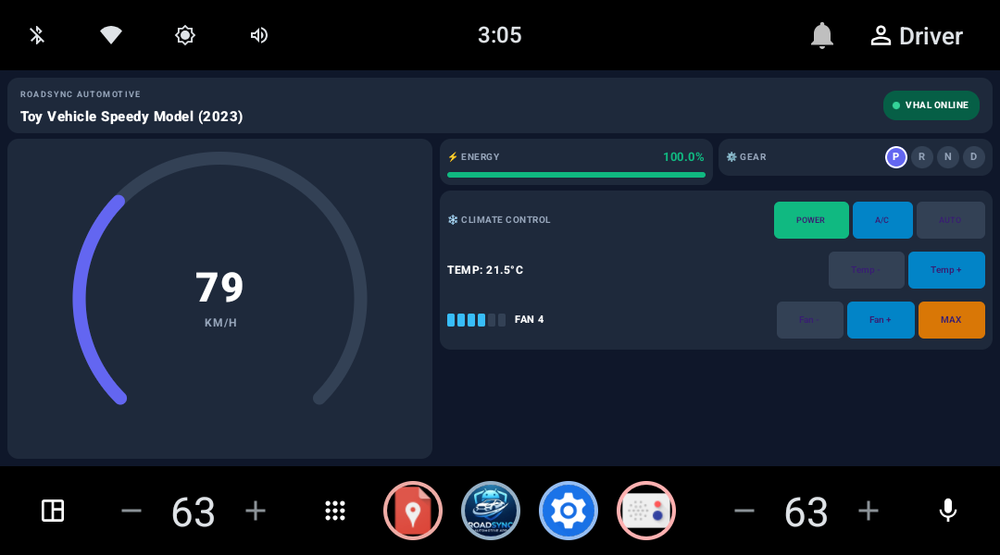

# 🚗 RoadSync Automotive - VHAL Demo App

A modern, production-grade **Android Automotive OS (AAOS)** Digital Cluster Dashboard application built with **Jetpack Compose**, **Hilt**, **Coroutines / StateFlow**, and the **Android Vehicle Hardware Abstraction Layer (VHAL)** API.

---

## 🎥 Live Demo & Video Walkthrough

Watch the RoadSync Automotive Digital Cluster Dashboard and VHAL controls in action:

[](https://rampgroups-my.sharepoint.com/:v:/g/personal/pramod_kumar_resolence_com/IQAnhhC9LjcjT79JNhywm4QVAaqPtH2wMgSvHsIi6YpTzmY?e=I5PtcK)

🎬 **[Click Here to Watch Full Video Walkthrough](https://rampgroups-my.sharepoint.com/:v:/g/personal/pramod_kumar_resolence_com/IQAnhhC9LjcjT79JNhywm4QVAaqPtH2wMgSvHsIi6YpTzmY?e=I5PtcK)**

---

## 🌟 Key Features & Functionalities

### 1. 🏎️ Real-Time Digital Speedometer Gauge
- Reads live vehicle speed from `VehiclePropertyIds.PERF_VEHICLE_SPEED`.
- Converts raw VHAL velocity (`m/s`) to `km/h` (`m/s * 3.6`).
- **Stepped Acceleration/Deceleration:** Implements a realistic needle/digit stepping animation (`1 km/h per 15ms`) instead of abrupt jumps.
- **IEEE 754 Floating-Point Protection:** Prevents negative zero (`-0.0f`) artifacts during deceleration.
- **Dynamic Speed Color Mapping:**
  - 🟢 **0–60 km/h:** Blue (`#3B82F6`)
  - 🟣 **60–120 km/h:** Indigo (`#6366F1`)
  - 🟠 **120–180 km/h:** Orange (`#F59E0B`)
  - 🔴 **180+ km/h:** Red (`#EF4444`)

### 2. ⚡ Energy & Fuel Meter
- Monitors `VehiclePropertyIds.EV_BATTERY_LEVEL` and `VehiclePropertyIds.FUEL_LEVEL`.
- Displays real-time fuel/battery percentage with dynamic status colors:
  - 🟢 **Green** (> 30%)
  - 🟠 **Orange** (15%–30%)
  - 🔴 **Red** (< 15% Warning)

### 3. ⚙️ Active Gear Position Indicator
- Reads `VehiclePropertyIds.GEAR_SELECTION`.
- Displays active drive mode badges: **P** (Park), **R** (Reverse), **N** (Neutral), and **D** (Drive).

### 4. ❄️ Complete HVAC Climate & Fan Control Suite
- **Power Switch (`HVAC_POWER_ON`):** Master climate system ON/OFF toggle.
- **A/C Compressor (`HVAC_AC_ON`):** Air conditioning compressor toggle.
- **AUTO Climate Mode (`HVAC_AUTO_ON`):** Automatic climate regulation mode.
- **Temperature Adjuster (`HVAC_TEMPERATURE_SET`):** Digital target temperature control (`16.0°C`–`30.0°C` in 0.5°C steps).
- **Fan Speed Control (`HVAC_FAN_SPEED`):** Incremental speed adjustment (`Levels 1–6`), LED status bars, and a **`MAX`** turbo fan speed shortcut.

### 5. 🚘 Vehicle Identification
- Reads static OEM info on connection (`INFO_MAKE`, `INFO_MODEL`, `INFO_MODEL_YEAR`).

---

## 🏗️ Architecture & Data Flow

This project follows **Clean Architecture**, **MVVM**, and **Unidirectional Data Flow (UDF)** principles:

```
┌─────────────────────────────────────────────────────────┐
│              Vehicle Hardware / VHAL Sensors             │
└────────────────────────────┬────────────────────────────┘
                             │ (CarPropertyEventCallback)
                             ▼
┌─────────────────────────────────────────────────────────┐
│               VehiclePropertyRepository                 │
│  - Registers VHAL callbacks                             │
│  - Converts units (m/s -> km/h)                         │
│  - Handles VHAL read/write hardware exceptions           │
└────────────────────────────┬────────────────────────────┘
                             │ updates
                             ▼
┌─────────────────────────────────────────────────────────┐
│            MutableStateFlow<VehicleUiState>             │
│            StateFlow<VehicleUiState> (Read-Only)        │
└────────────────────────────┬────────────────────────────┘
                             │
                             ▼
┌─────────────────────────────────────────────────────────┐
│                     VhalViewModel                       │
│  - Bridges repository state to UI                       │
│  - Exposes climate & fan control functions               │
└────────────────────────────┬────────────────────────────┘
                             │ collectAsStateWithLifecycle()
                             ▼
┌─────────────────────────────────────────────────────────┐
│                 Jetpack Compose UI                      │
│  - 2x2 Grid Automotive Digital Cockpit Dashboard        │
└─────────────────────────────────────────────────────────┘
```

---

## 🛡️ Privileged System App Setup (`/system/priv-app/`)

To access sensitive VHAL properties (`CAR_SPEED`, `CAR_ENERGY`, `CONTROL_CAR_CLIMATE`), this app is configured as a **Privileged System App**:

1. **App Location:** `/system/priv-app/MyAutomotiveApp/MyAutomotiveApp.apk`
2. **Permissions Whitelist:** `/system/etc/permissions/privapp-permissions-com.example.vhaldemoapp.xml`

### Whitelisted Permissions (`privapp-permissions.xml`):
```xml
<?xml version="1.0" encoding="utf-8"?>
<permissions>
    <privapp-permissions package="com.example.vhaldemoapp">
        <permission name="android.car.permission.CAR_POWERTRAIN"/>
        <permission name="android.car.permission.CAR_VENDOR_EXTENSION"/>
        <permission name="android.car.permission.CAR_IDENTIFICATION"/>
        <permission name="android.car.permission.CAR_INFO"/>
        <permission name="android.car.permission.CAR_SPEED"/>
        <permission name="android.car.permission.CAR_ENERGY"/>
        <permission name="android.car.permission.CAR_HVAC"/>
        <permission name="android.car.permission.CONTROL_CAR_CLIMATE"/>
        <permission name="android.permission.RECEIVE_BOOT_COMPLETED"/>
    </privapp-permissions>
</permissions>
```

---

## 🚀 Deployment & Development Workflows

### Option A: Fast Automated Local Deployment (`push_priv_app.ps1`)

Run the automated deployment script in PowerShell:

```powershell
powershell -ExecutionPolicy Bypass -File .\push_priv_app.ps1
```

*(This script automatically handles `-writable-system` detection, `adb root`, `adb remount`, pushing files to `/system/priv-app/`, granting permissions to `User 10`, and launching `MainActivity`).*

---

### Option B: Fast Daily UI Iteration (`adb install -r`)

Once the base system app is in `/system/priv-app/`, you do **not** need to rebuild the system image for code or UI changes. Simply run:

```powershell
./gradlew assembleDebug
adb install -r --user 10 app/build/outputs/apk/debug/app-debug.apk
adb shell am force-stop com.example.vhaldemoapp
adb shell am start --user 10 -n com.example.vhaldemoapp/.MainActivity
```

---

### Option C: Production AOSP System Image Baking (`aosp_integration/`)

For production image builds where the app is baked directly into AOSP `system.img`:

1. Copy `aosp_integration/` to `device/generic/automotive/vhaldemoapp/` in your AOSP tree.
2. Add `PRODUCT_PACKAGES += VHALDemoApp` in your product configuration (`device.mk`).
3. Build AOSP:
   ```bash
   source build/envsetup.sh
   lunch sdk_car_x86_64-userdebug
   m -j$(nproc)
   ```

---

## 🛠️ ADB VHAL Signal Debugging Commands

Use these commands to simulate vehicle hardware signals on the emulator:

```powershell
# 1. Simulate Vehicle Speed = 90 km/h (25.0 m/s)
adb shell cmd car_service inject-continuous-events 0x11600207 25.0

# 2. Simulate Vehicle Speed = 0 km/h
adb shell cmd car_service inject-continuous-events 0x11600207 0.0

# 3. Simulate EV Battery Level = 85%
adb shell cmd car_service inject-vhal-event EV_BATTERY_LEVEL 0 85.0

# 4. Change Gear to DRIVE (8)
adb shell cmd car_service inject-vhal-event GEAR_SELECTION 0 8

# 5. Change Gear to PARK (4)
adb shell cmd car_service inject-vhal-event GEAR_SELECTION 0 4

# 6. Read Live Property Value
adb shell cmd car_service get-property-value PERF_VEHICLE_SPEED
```

---

## 📁 Project Structure

```text
VHALDemoApp2/
├── app/src/main/java/com/example/vhaldemoapp/
│   ├── MainActivity.kt                      # Jetpack Compose 2x2 Cockpit Dashboard UI
│   ├── VhalDemoApplication.kt               # Hilt Application Class
│   ├── boot/BootCompletedReceiver.kt        # Boot Receiver
│   ├── data/
│   │   ├── CarInfoData.kt                   # Vehicle Info Data Class
│   │   ├── VehiclePropertyRepository.kt     # VHAL CarPropertyManager Repository
│   │   └── VhalProperties.kt                # Custom VHAL Property IDs
│   ├── model/
│   │   └── VehicleUiState.kt                # Immutable UI State Model
│   ├── service/
│   │   └── CarPropertyMonitoringService.kt  # Background Car Service Monitor
│   └── ui/
│       └── VhalViewModel.kt                 # Hilt ViewModel for StateFlow
├── aosp_integration/                        # AOSP System Image Baking Blueprint
│   ├── Android.bp                           # AOSP Module Build File
│   ├── com.example.vhaldemoapp.xml          # Privileged Permission Whitelist
│   └── README_AOSP_BAKING.md                # Production AOSP Build Guide
├── push_priv_app.ps1                        # Automated System App Deployment Script
└── README.md                                # Project Documentation
```
